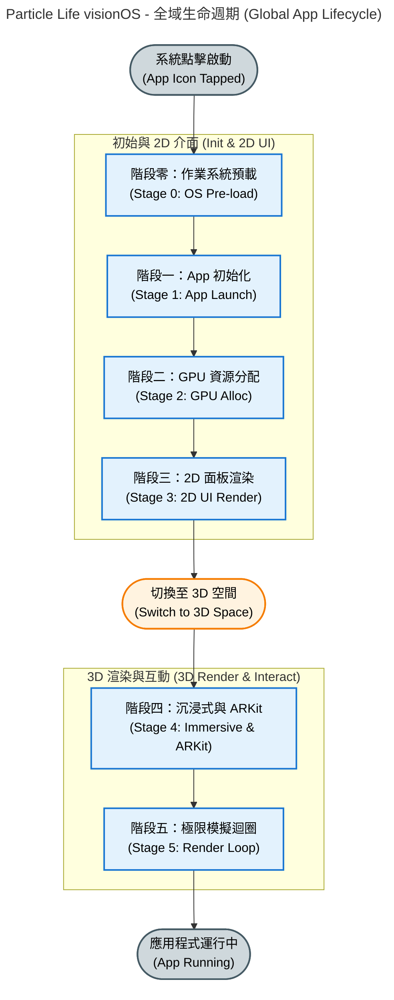
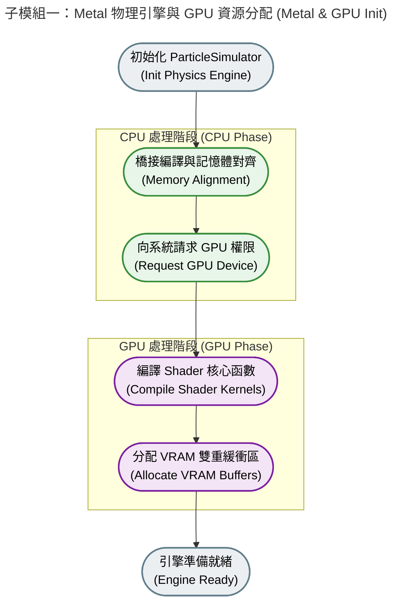
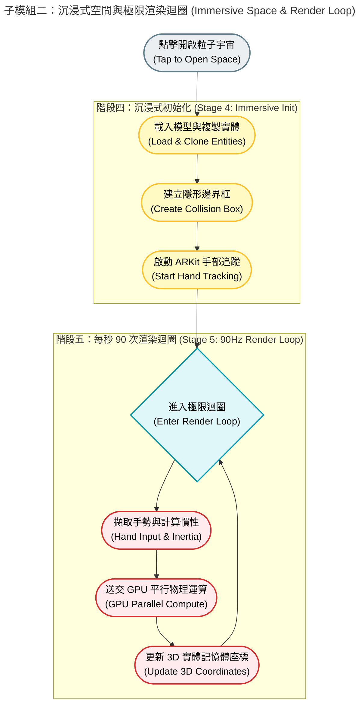

# 🌌 Particle Life visionOS


- 為 Apple Vision Pro 打造的「粒子生命 (Particle Life)」模擬器。
- 透過結合 **`Metal Compute Shader`** 的 GPU 平行運算、**`ARKit`** 骨架手勢追蹤，以及 **`RealityKit`** 的沉浸式渲染，玩家可以直接用雙手在空間中「撈取」並擾動這個由數千顆微小粒子組成的浮游生態系。


---

## 📂 專案結構 (Project Structure)

本專案採用清晰的架構，將 UI 介面、渲染層與底層 GPU 物理引擎完全解耦：

```markdown
particle-vision/
├── README.md                                 # 專案說明文件
├── Simulation/                               # 核心大腦與 GPU 運算層
│   ├── ParticleSimulator.swift               # 管理 Metal 狀態、雙重緩衝區排序與空間慣性運算
│   ├── particle-vision-Bridging-Header.h     # Swift 與 Metal 的橋接標頭檔
│   ├── ParticleCompute.metal                 # GPU Compute Shader：極致效能的網格排序與引力矩陣
│   └── SharedTypes.h                         # Swift 與 Metal 共用的資料結構與參數定義
├── particle-vision/                          # UI 介面與 RealityKit 渲染層
│   ├── Resources/                            # 資源資料夾
│   ├── AppModel.swift                        # 應用程式全域狀態模型
│   ├── Assets.xcassets                       # 圖片與色彩等靜態資源
│   ├── ContentView.swift                     # 主視窗容器
│   ├── ControlPanelView.swift                # SwiftUI 參數調整介面 (數量、種類、大小、摩擦力)
│   ├── ImmersiveView.swift                   # 沉浸式空間視圖，負責 RealityKit 實體渲染與骨架追蹤
│   ├── Info.plist                            # 專案設定檔
│   ├── ParticleVisionApp.swift               # App 進入點，配置視窗大小與註冊 ImmersiveSpace
│   ├── SimulationSettings.swift              # 模擬器參數設定模型
│   ├── Sphere.usda                           # 粒子的基礎 3D 原始模型
│   └── ToggleImmersiveSpaceButton.swift      # 控制進入/退出沉浸式空間的獨立按鈕元件
└── particle-visionTests/                     # 單元測試模組
    └── ParticleVisionTests.swift             # 測試腳本
```


## ✨ 核心特色 (Key Features)

### 🚀 突破極限的 GPU 物理運算 (Metal Compute Shader)
- **空間雜湊 (Spatial Hashing)**：將 $O(N^2)$ 的碰撞複雜度降至 $O(N)$，確保海量粒子在三維空間中的運算效率。
- **GPU 空間排序 (Spatial Sorting / Cache Locality)**：實作計數排序 (Counting Sort) 與前綴和 (Prefix Sum)，確保物理空間相近的粒子在 GPU 記憶體中也絕對連續，快取命中率 (Cache Hit Rate) 逼近 100%。
- **嚴格的硬體層級防護**：利用 `memoryBarrier` 與 `16-byte` 記憶體強制對齊，解決了非同步運算造成的 Race Condition 與核心崩潰 (Kernel Panic)。

### 🖐️ 沉浸式實體反饋 (Scoop Net Physics)
- **撈魚網物理學**：不同於一般的平移，當使用者移動邊界盒子時，Metal 端會即時計算相對慣性 (Inertia) 與穿透動能 (Penetration Impulse)，讓邊界具備將粒子「推擠撈起」的真實物理手感。
- **精確骨架追蹤**：基於 ARKit 的手部骨架節點分析 (`findPinchingHand`)，實現穩定且無死角的單手 6-DOF 空間拖曳。

### 🎛️ 即時動態控制面板 (SwiftUI)
提供美觀且不裁切的空間浮動視窗，支援即時無縫調整以下參數：
- **粒子數量**：動態增減 (100 ~ 4000 顆)，預設為 2500 顆最穩定。
- **粒子種類**：支援 2 ~ 8 種不同屬性的粒子互相吸引/排斥 (預設 6 種)。
- **空間摩擦力 (Friction)**：即時調整宇宙的「黏滯感」(0.70 泥漿阻力 ~ 0.99 太空滑行)。
- **隨機引力規則**：一鍵重組基因矩陣，觀察全新的細胞群聚演化。

---

## 🛠️ 技術細節 (Technical Details)

本專案解決了 visionOS 開發中多個高難度的效能與渲染痛點：
1. **解決 GPU 排序導致的顏色閃爍**：透過賦予粒子不變的 `originalIndex` (身分證)，成功解耦了 GPU 連續記憶體排序與 RealityKit Entity 之間的綁定關係。
2. **無效能冗餘的邊界渲染**：拔除了耗能的毛玻璃 (Glass Shader) 實體，改用純數學計算的 12 道極細 Wireframe 框線，達成 **Zero GPU Overdraw** 的高幀率表現。
3. **視窗完美適配**：透過自訂 `defaultSize` 與 `frame(minWidth:minHeight:)`，確保控制面板在任何狀態下皆不會被作業系統裁切。

---

## 💻 系統需求 (Requirements)

* **硬體**: Apple Vision Pro (實機測試表現最佳) 或 visionOS Simulator
* **系統**: visionOS 1.0+
* **開發環境**: Xcode 15.2+ (請確保以 **Release Mode** 建置以獲得最佳物理模擬幀率)

---

## 🎮 如何操作 (How to Play)

1. 點擊控制面板上的 **「開啟粒子宇宙」** 進入沉浸式空間。
2. 觀賞粒子依據隨機生成的引力矩陣 (Attraction/Repulsion Matrix) 逐漸聚集成細胞、薄膜或蠕蟲等不可思議的形狀。
3. **放大/縮小**：雙手同時使用放大手勢 (Magnify Gesture) 調整宇宙的整體尺寸。
4. **移動與物理擾動**：單手捏合 (Pinch) 邊界盒子的任何一處並拖曳，即可像拿著網子一樣在空間中撈取、撞擊這些粒子！

---
## Under the Hood

當你在 Apple Vision Pro 的主畫面點擊這個 App 的圖示後，系統會依照以下的時間序（Chronological Order）載入檔案、建立相依性，並調用對應的硬體資源：

### **階段零：作業系統預載 (OS Pre-launch)**

在任何 Swift 程式碼執行之前，visionOS 會先讀取靜態設定檔與資源。

* **相依檔案**：Info.plist、Assets.xcassets  
* **功能**：系統讀取 Info.plist 來確認 App 的基本屬性（例如預設視窗大小、是否需要 ARKit 雙手追蹤權限等），並預先將 Assets.xcassets 內的圖示與靜態色彩載入記憶體。  
* **硬體資源**：儲存空間 (Storage) \-\> 主記憶體 (RAM)。

### **階段一：App 啟動與全域狀態初始化**

程式碼正式開始執行，建立整個 App 的生命週期與資料大腦。

* **觸發檔案**：ParticleVisionApp.swift (標註 @main 的進入點)  
* **相依檔案**：AppModel.swift、SimulationSettings.swift、ParticleSimulator.swift  
* **功能**：  
  1. ParticleVisionApp.swift 被喚醒，宣告一個 WindowGroup (2D 視窗) 與一個 ImmersiveSpace (3D 空間)。  
  2. 它會實體化全域狀態模型（如 AppModel 或直接實體化 ParticleSimulator），將其作為 @Environment 注入到整個 App 的環境中，確保所有的 UI 與 3D 視圖都共用同一個「物理大腦」。  
* **硬體資源**：CPU (負責執行初始化邏輯)、主記憶體 RAM (配置全域變數的記憶體空間)。

### **階段二：Metal 物理引擎與 GPU 資源分配 (核心關鍵)**

在 ParticleSimulator.swift 被初始化的瞬間，它會立刻與底層的顯示卡 (GPU) 建立極速通訊通道。

* **觸發檔案**：ParticleSimulator.swift 的 init()  
* **相依檔案**：SharedTypes.h、particle-vision-Bridging-Header.h、ParticleCompute.metal  
* **功能**：  
  1. **橋接編譯**：透過 Bridging-Header 與 SharedTypes.h，Swift 確保了 CPU 端的 Particle 與 Cell 結構體記憶體對齊（16-bytes padding），與 GPU 端完全一致。  
  2. **獲取 GPU 權限**：ParticleSimulator 向系統請求 MTLCreateSystemDefaultDevice()。  
  3. **編譯 Shader**：讀取並編譯 ParticleCompute.metal 中的 5 個 Kernel 函數（清空、計數、前綴和、排序、運算），建立 MTLComputePipelineState。  
  4. **分配 VRAM**：在 GPU 的 Private 與 Shared 記憶體區塊中，開闢 particleBuffer 與 gridBuffer 等雙重緩衝區。  
* **硬體資源**：GPU 控制器、統一記憶體架構 (Unified Memory \- 同時給 CPU/GPU 存取的高速 RAM)。

### **階段三：2D 控制面板渲染**

物理大腦準備就緒後，系統開始繪製使用者看得到的懸浮玻璃視窗。

* **觸發檔案**：ContentView.swift  
* **相依檔案**：ControlPanelView.swift、ToggleImmersiveSpaceButton.swift  
* **功能**：  
  1. ContentView 排版主視覺，並嵌入子元件。  
  2. ControlPanelView 讀取 ParticleSimulator 中的狀態（如 2500顆、摩擦力 0.95），並繪製拉桿 (Slider)。當使用者拖曳拉桿時，它會直接修改 Simulator 的參數。  
  3. ToggleImmersiveSpaceButton 準備好監聽使用者的點擊事件，用來開啟 3D 空間。  
* **硬體資源**：CPU (計算 SwiftUI 佈局)、GPU (渲染 2D 玻璃材質與文字)、顯示器 (Display)。

### **階段四：進入沉浸式空間與 ARKit 啟動**

使用者點擊「開啟粒子宇宙」按鈕，App 正式從 2D 跨入 3D 空間運算。

* **觸發檔案**：ImmersiveView.swift  
* **相依檔案**：Sphere.usda、ParticleSimulator.swift  
* **功能**：  
  1. **載入 3D 模型**：從 Resources 載入 Sphere.usda 作為基礎，RealityKit 在記憶體中快速複製 (Clone) 出 2500 顆實體 (Entity)，並依據 originalIndex 賦予材質顏色。  
  2. **建立隱形邊界**：生成一個帶有 CollisionComponent 的透明 Wireframe 邊界框，用來接收使用者的碰撞。  
  3. **啟動 ARKit 手勢追蹤**：向系統請求 HandTrackingProvider，開始掃描使用者的雙手骨架節點 (findPinchingHand)。  
* **硬體資源**：  
  * **GPU**：啟動 RealityKit 3D 渲染引擎。  
  * **ARKit 專屬硬體**：外部攝影機 (追蹤手部影像)、光學雷達 LiDAR / 深度感測器 (建構空間深度)。  
  * **神經網路引擎 (Neural Engine)**：以極低功耗執行機器學習模型，即時辨識雙手 25 個關節的精確 3D 座標。

### **階段五：每秒 90 次的極限模擬迴圈 (The Render Loop)**

這是 App 運行時持續發生的動作，也是專案中最吃重硬體效能的階段。

* **交互循環**：ImmersiveView 🔄 ParticleSimulator 🔄 ParticleCompute.metal  
* **功能運作 (以 1 幀為例，每秒發生 90 次)**：  
  1. **輸入擷取 (CPU/ARKit)**：ImmersiveView 讀取最新的手部 Pinch 座標，計算出邊界盒子的位移矩陣。  
  2. **空間慣性 (CPU)**：ParticleSimulator 執行 applyInertia，將盒子的相對位移套用到所有粒子的座標上（撈魚網物理學）。  
  3. **發送運算指令 (CPU \-\> GPU)**：updateSimulation() 將 5 個運算步驟（包含 memoryBarrier 保護）打包成 Command Buffer 送交 GPU 佇列。  
  4. **平行物理運算 (GPU)**：ParticleCompute.metal 喚醒數千個 GPU 執行緒，在一瞬間完成 2500 顆粒子的網格排序、碰撞偵測與引力計算。  
  5. **畫面更新 (CPU/GPU)**：ImmersiveView 透過 originalIndex 從 GPU 排好序的記憶體中讀出最新座標，更新 RealityKit 的 2500 個 Entity，最終由合成器 (Compositor) 輸出到雙眼螢幕。  
* **硬體資源**：  
  * **CPU**：負責邏輯調度、矩陣相乘、與 ARKit 溝通。  
  * **GPU Compute Cores (運算核心)**：滿載執行 Spatial Hashing 與浮點數運算。  
  * **高頻寬記憶體匯流排**：CPU 與 GPU 之間每秒進行 90 次的高速資料交換。  
  * **雙眼 Micro-OLED 螢幕**：以 90Hz 的更新率渲染出具備空間感的立體畫面。

## Flowchart







---

## 📄 授權協議 (License)

本專案採用 [MIT License](LICENSE) 授權。歡迎自由 Fork、修改與應用於你的 visionOS 專案中！
