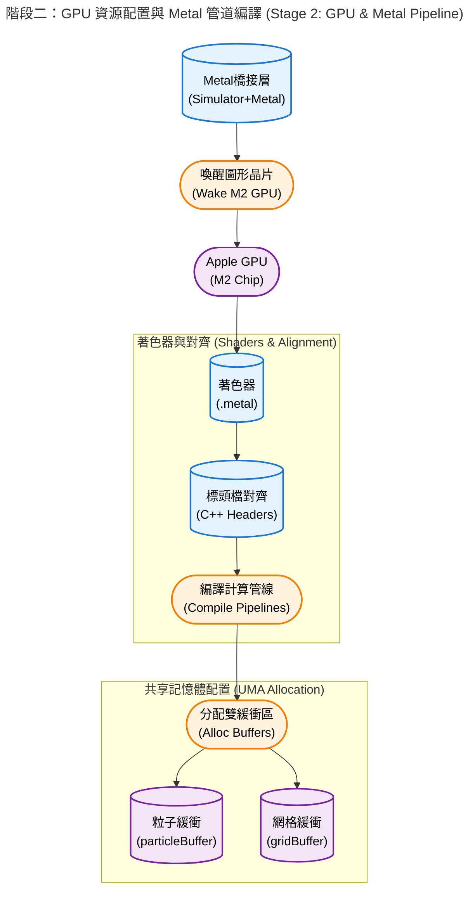
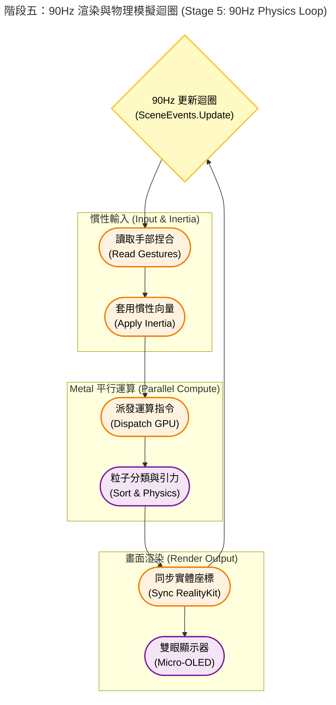

# 🌌 Particle Life visionOS


- 為 Apple Vision Pro 打造的「粒子生命 (Particle Life)」模擬器。
- 透過結合 **`Metal Compute Shader`** 的 GPU 平行運算、**`ARKit`** 骨架手勢追蹤，以及 **`RealityKit`** 的沉浸式渲染，玩家可以直接用雙手在空間中「撈取」並擾動這個由數千顆微小粒子組成的浮游生態系。


---

## 📂 專案結構 (Project Structure)

本專案採用清晰的架構，將 UI 介面、渲染層與底層 GPU 物理引擎完全解耦：

```text
.
├── particle-vision                             // 應用程式主要原始碼目錄
│   ├── AppModel.swift                          // 管理 App 全域狀態的資料模型
│   ├── Assets.xcassets                         // 靜態資源檔 (圖片、顏色、App 圖示)
│   │   ├── AccentColor.colorset              // 系統強調色設定
│   │   │   └── Contents.json
│   │   ├── AppIcon.solidimagestack           // visionOS 專用的 3D 多層次 App 圖示
│   │   │   ├── Back.solidimagestacklayer     // 圖示背景層
│   │   │   ├── Front.solidimagestacklayer    // 圖示前景層
│   │   │   └── Middle.solidimagestacklayer   // 圖示中間層
│   │   │   └── Contents.json
│   │   └── Contents.json
│   ├── ContainerDragGesture.swift.swift        // [重構] 單手拖曳與旋轉宇宙的手勢修飾器 (ViewModifier)
│   ├── ContainerMagnifyGesture.swift           // [重構] 雙手捏合縮放宇宙的手勢修飾器
│   ├── ContentView.swift                       // 2D 主視窗介面 (包含標題與控制面板)
│   ├── ControlPanelView.swift                  // 粒子參數控制面板 UI (調整摩擦力、數量等)
│   ├── Entity+Extensions.swift                 // [重構] RealityKit 實體工具擴充 (繪製邊框、尋找子節點)
│   ├── ImmersiveView.swift                     // 3D 沉浸式空間主視圖 (極度簡化的核心視圖)
│   ├── ImmersiveView+HandTracking.swift        // [重構] ARKit 手部追蹤與物理慣性推擠邏輯
│   ├── ImmersiveView+Particles.swift           // [重構] RealityKit 視覺實體生成與 GPU 座標同步邏輯
│   ├── Info.plist                              // App 系統設定檔 (權限與屬性)
│   ├── ParticleVisionApp.swift                 // App 進入點 (註冊 WindowGroup 與 ImmersiveSpace)
│   ├── Resources                               // 預設的 3D 資源資料夾
│   │   ├── Immersive.usda                      // 預設 3D 場景
│   │   ├── Materials                           
│   │   │   └── GridMaterial.usda               // 網格材質設定
│   │   └── Scene.usda                          // 預設場景
│   ├── SimulationSettings.swift                // UI 綁定用的模擬器設定檔
│   ├── Sphere.usda                             // 作為粒子視覺模板的 3D 圓球模型
│   └── ToggleImmersiveSpaceButton.swift        // [重構] 開啟/關閉 3D 粒子宇宙的獨立按鈕元件
├── particle-vision.xcodeproj                   // Xcode 專案檔 (管理編譯設定與檔案參照)
│   ├── project.pbxproj
│   └── project.xcworkspace
│       ├── contents.xcworkspacedata
│       └── xcshareddata
│           └── swiftpm
│               └── configuration
├── particle-visionTests                        // 單元測試與 UI 測試目錄
│   └── ParticleVisionTests.swift
├── README.md                                   // 專案說明文件
└── Simulation                                  // [重構] 核心物理模擬與 Metal GPU 運算模組
    ├── GridSorting.metal                       // [重構] Metal 空間網格劃分、計數與排序著色器
    ├── particle-vision-Bridging-Header.h       // Swift 與 Objective-C/Metal 溝通的橋接標頭檔
    ├── ParticlePhysics.metal                   // [重構] Metal 粒子吸引排斥規則與邊界碰撞著色器
    ├── ParticleSimulator.swift                 // [重構] 管理模擬器狀態與 GPU 緩衝區的主類別 (@Observable)
    ├── ParticleSimulator+Metal.swift           // [重構] 封裝 Metal Pipeline 初始化與運算指令派發的擴充
    ├── ParticleTypes.h                         // [重構] Metal 著色器共用的資料結構 (Structs) 與輔助函式
    ├── SharedTypes.h                           // 定義 Swift 與 Metal 共用的記憶體對齊資料結構
    └── SimulationModels.swift                  // [重構] Swift 端的基礎資料模型 (Particle, SimParams)
```


## ✨ 核心特色 (Key Features)

### 🚀 突破極限的 GPU 物理運算 (Metal Compute Shader)
- **空間雜湊 (Spatial Hashing)**：將 $O(N^2)$ 的碰撞複雜度降至 $O(N)$，確保海量粒子在三維空間中的運算效率。
- **GPU 空間排序 (Spatial Sorting / Cache Locality)**：實作計數排序 (Counting Sort) 與前綴和 (Prefix Sum)，確保物理空間相近的粒子在 GPU 記憶體中也絕對連續，快取命中率 (Cache Hit Rate) 逼近 100%。
- **嚴格的硬體層級防護**：利用 `memoryBarrier` 與 `16-byte` 記憶體強制對齊，解決了非同步運算造成的 Race Condition 與核心崩潰 (Kernel Panic)。

### 🖐️ 沉浸式實體反饋 (Scoop Net Physics)
- **撈魚網物理學**：不同於一般的平移，當使用者移動邊界盒子時，Metal 端會即時計算相對慣性 (Inertia) 與穿透動能 (Penetration Impulse)，讓邊界具備將粒子「推擠撈起」的真實物理手感。
- **精確骨架追蹤**：基於 ARKit 的手部骨架節點分析 (`findPinchingHand`)，實現穩定且無死角的單手 6-DOF 空間拖曳。

### 🎛️ 即時動態控制面板 (SwiftUI)
提供美觀且不裁切的空間浮動視窗，支援即時無縫調整以下參數：
- **粒子數量**：動態增減 (100 ~ 4000 顆)，預設為 2500 顆最穩定。
- **粒子種類**：支援 2 ~ 8 種不同屬性的粒子互相吸引/排斥 (預設 6 種)。
- **空間摩擦力 (Friction)**：即時調整宇宙的「黏滯感」(0.70 泥漿阻力 ~ 0.99 太空滑行)。
- **隨機引力規則**：一鍵重組基因矩陣，觀察全新的細胞群聚演化。

---

## 🛠️ 技術細節 (Technical Details)

本專案解決了 visionOS 開發中多個高難度的效能與渲染痛點：
1. **解決 GPU 排序導致的顏色閃爍**：透過賦予粒子不變的 `originalIndex` (身分證)，成功解耦了 GPU 連續記憶體排序與 RealityKit Entity 之間的綁定關係。
2. **無效能冗餘的邊界渲染**：拔除了耗能的毛玻璃 (Glass Shader) 實體，改用純數學計算的 12 道極細 Wireframe 框線，達成 **Zero GPU Overdraw** 的高幀率表現。
3. **視窗完美適配**：透過自訂 `defaultSize` 與 `frame(minWidth:minHeight:)`，確保控制面板在任何狀態下皆不會被作業系統裁切。

---

## 💻 系統需求 (Requirements)

* **硬體**: Apple Vision Pro (實機測試表現最佳) 或 visionOS Simulator
* **系統**: visionOS 1.0+
* **開發環境**: Xcode 15.2+ (請確保以 **Release Mode** 建置以獲得最佳物理模擬幀率)

---

## 🎮 如何操作 (How to Play)

1. 點擊控制面板上的 **「開啟粒子宇宙」** 進入沉浸式空間。
2. 觀賞粒子依據隨機生成的引力矩陣 (Attraction/Repulsion Matrix) 逐漸聚集成細胞、薄膜或蠕蟲等不可思議的形狀。
3. **放大/縮小**：雙手同時使用放大手勢 (Magnify Gesture) 調整宇宙的整體尺寸。
4. **移動與物理擾動**：單手捏合 (Pinch) 邊界盒子的任何一處並拖曳，即可像拿著網子一樣在空間中撈取、撞擊這些粒子！

---
## ⚙️ Under the Hood

- 在 Apple Vision Pro 的主畫面（Home View）點擊這個 App 的 3D 圖示（`AppIcon.solidimagestack`）時，visionOS 系統會啟動一連串精密的軟硬體協作程序。以下是依照時間序展開的檔案載入、相依性建立與硬體資源調用流程：

### 1. 應用程式啟動與 2D 視窗初始化 (CPU 主導)

* **讀取設定與進入點：** 系統首先讀取 `Info.plist` 確認權限（如手部追蹤要求），接著進入 `@main` 標記的 **`ParticleVisionApp.swift`**。這裡是 App 的大腦，它會向系統註冊兩種場景：一個預設開啟的 `WindowGroup` (2D 視窗) 以及一個待命的 `ImmersiveSpace` (3D 空間)。
* **建構控制介面：** CPU 接著載入 **`ContentView.swift`** 並將其渲染在 2D 玻璃視窗上。在此同時，**`ControlPanelView.swift`** 與 **`ToggleImmersiveSpaceButton.swift`** 也被實例化，準備接收使用者的輸入。此時 GPU 負載極低，僅處理標準的 SwiftUI 渲染。
* **全域狀態待命：** 若你在 App 層級注入了 `@State var simulator = ParticleSimulator()`，此時 **`ParticleSimulator.swift`** 會進行初步實例化，並讀取 **`SimulationModels.swift`** 定義的基礎資料結構。


### 2. GPU 資源配置與 Metal 管道編譯 (GPU 主導)

當 `ParticleSimulator` 被實例化時，會立即觸發其 `init()` 流程，這是打通底層硬體的關鍵時刻：

* **呼叫 Metal 框架：** 流程進入 **`ParticleSimulator+Metal.swift`**，系統會透過 `MTLCreateSystemDefaultDevice()` 喚醒 Apple Silicon (M2 晶片) 的 GPU。
* **載入並編譯著色器：** GPU 會讀取由 **`GridSorting.metal`** 與 **`ParticlePhysics.metal`** 預先編譯好的 `.metallib` 檔案。系統會透過 **`ParticleTypes.h`** 與 **`SharedTypes.h`** 確保 Swift 與 C++ 之間的記憶體對齊，隨後建立出如 `clearGridPipeline`、`computeGridPipeline` 等計算管線狀態（Compute Pipeline States）。
* **分配共享記憶體：** 系統會在統一記憶體架構（UMA）中劃分出 `particleBuffer` 與 `gridBuffer`。這些記憶體被標記為 `.storageModeShared` 或 `.storageModePrivate`，讓 CPU 與 GPU 能以零拷貝（Zero-copy）的高效方式存取 16,000 顆粒子的初始位置與速度。



### 3. 沉浸空間啟動與 AR 感測器喚醒 (R1 晶片與感測器)

當你在 2D 視窗點擊「啟動 3D 粒子空間」時：

* **觸發空間轉換：** **`ToggleImmersiveSpaceButton.swift`** 向系統發送 `openImmersiveSpace(id: "ParticleSpace")` 的非同步請求。
* **建構 3D 視圖：** visionOS 淡出背景，載入 **`ImmersiveView.swift`**。
* **喚醒空間運算硬體：** `ImmersiveView` 內部的 `.task` 啟動 `ARKitSession` 與 `HandTrackingProvider`。這會直接喚醒 Vision Pro 的 **R1 晶片**（負責即時感測器處理），啟動向下的追蹤攝影機與紅外線感測器，開始以極低延遲捕捉使用者的雙手骨骼節點，並將資料寫入 `latestHandAnchors`。


### 4. 視覺資產載入與實體綁定 (CPU 與 RealityKit 引擎)

* **載入 3D 網格：** CPU 讀取專案目錄下的 **`Sphere.usda`**，交由 **`Entity+Extensions.swift`** 進行解析並提取出模型核心（`findModelEntity`）。
* **生成海量實體：** 流程進入 **`ImmersiveView+Particles.swift`** 的 `setupParticleVisuals`。CPU 會根據 GPU 剛算好的 `particleBuffer`，在記憶體中快速 Clone 出 16,000 個 RealityKit `Entity`（或者在最新架構中使用 `LowLevelMesh`），並為不同分群套用純色材質（UnlitMaterial）。
* **部署互動邊界：** `Entity+Extensions.swift` 會為 `containerBox` 繪製白色的霓虹邊框，並加上 `CollisionComponent` 與 `InputTargetComponent`，使其能接收空間手勢。


### 5. 90Hz 渲染與物理模擬迴圈 (CPU、GPU、R1 協同運作)

當一切準備就緒，系統會以每秒 90 幀的速度觸發 `SceneEvents.Update` 迴圈：

* **手部輸入與慣性處理 (R1 -> CPU)：** **`ContainerDragGesture.swift`** 與 **`ContainerMagnifyGesture.swift`** 監聽捏合與縮放。**`ImmersiveView+HandTracking.swift`** 讀取 R1 晶片傳來的最新手部矩陣，若發生位移，則呼叫 `simulator.applyInertia()`，由 CPU 即時修改 GPU 緩衝區內的粒子速度向量。
* **Metal 平行運算 (CPU -> GPU)：** **`ParticleSimulator+Metal.swift`** 的 `updateSimulation()` 派發 Command Buffer。GPU 的數千個核心瞬間啟動，依序執行網格清除、粒子分類（`GridSorting.metal`）、以及基於細胞自動機規則的引力/排斥力與邊界碰撞計算（`ParticlePhysics.metal`）。
* **畫面渲染 (GPU -> 顯示器)：** 最後，**`ImmersiveView+Particles.swift`**（或直接透過 `LowLevelMesh` 的 Vertex Shader）將 GPU 算出的最新位置同步給 RealityKit。畫面被送入雙眼的高解析度 Micro-OLED 顯示器，完成一次完美的視覺更新。




---

## 📄 授權協議 (License)

本專案採用 [MIT License](LICENSE) 授權。歡迎自由 Fork、修改與應用於你的 visionOS 專案中！
---
