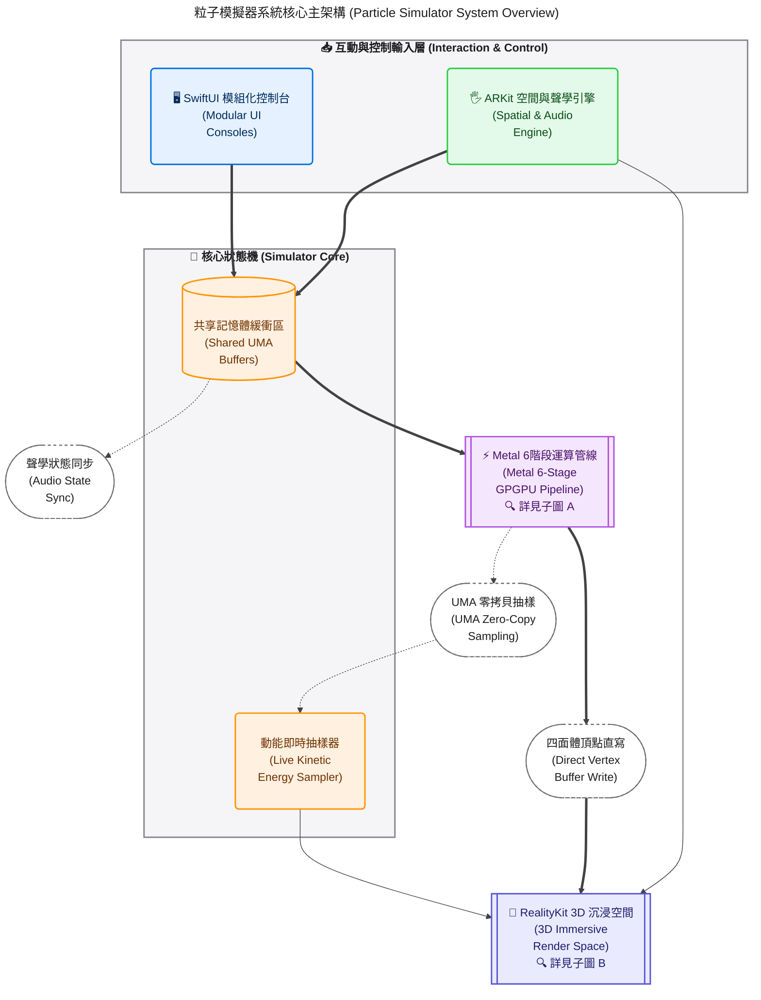
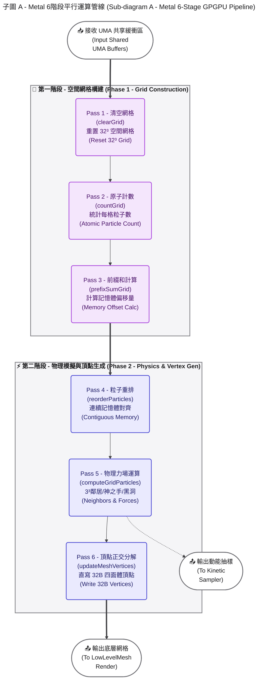
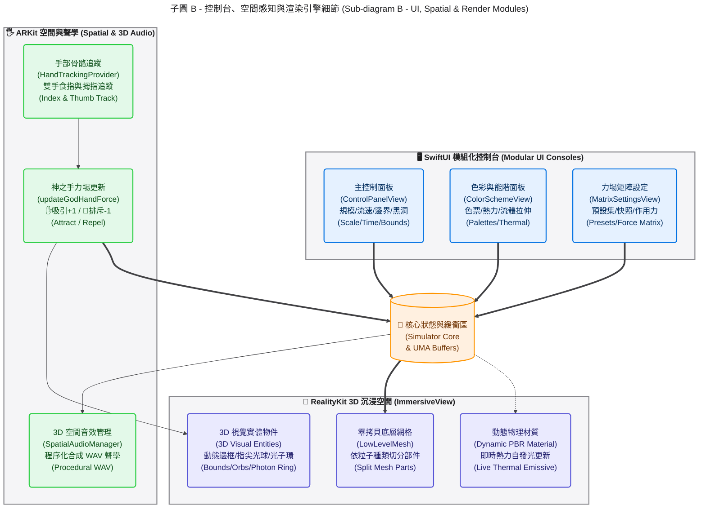

# 🌌 Particle Vision — 3D Spatial Particle Life & Astrophysical Simulator for visionOS

**Particle Vision (`particle-vision`)** 是一套專為 **Apple Vision Pro (visionOS)** 打造的高效能 3D 空間人工生命（Artificial Life）與天體物理力場模擬器。

透過 **Metal GPGPU 6-Pass 空間網格雜湊（Spatial Grid Hashing）** 與 **RealityKit `LowLevelMesh` 零拷貝（Zero-Copy）頂點直寫架構**，本專案能在 3D 混合實境空間中即時運算並渲染 **$50,000$ 至 $100,000$ 顆**具備非對稱交互作用力的 3D 四面體粒子，並結合 **ARKit 雙手「神之手」力場操控**、**即時動能熱力能階著色**、**相對論性黑洞雙極噴流**以及**程序化合成 3D 雙耳空間音效**。

---

## ✨ 核心特色總覽 (Key Features)

### 1. ⚡ 極致 GPGPU 零拷貝渲染管線 (Zero-Copy Metal Compute Pipeline)
* **$32^3$ 三維空間網格雜湊（$32,768$ Cells）**：將傳統 $\mathcal{O}(N^2)$ 的粒子交互作用時間複雜度大幅降至 $\mathcal{O}(N)$，在 $3 \times 3 \times 3$ 鄰近網格內高速查表計算非對稱引力與斥力。
* **`LowLevelMesh` 頂點緩衝區直寫**：每顆粒子由 $4$ 個頂點（$12$ 個索引）組成 3D 正四面體，每頂點嚴格對齊 **$32\text{ Bytes}$**（`position: float3` + `normal: float3`）。由 Metal Compute Shader（`updateMeshVertices`）直接在 GPU 記憶體內原地更新頂點與法向量，完全免除 CPU-GPU 每幀資料搬移瓶頸。

### 2. 🧬 非對稱三維規則矩陣與生態系預設集 ($N \times N$ Rule Matrices & Ecosystem Presets)
* **三組獨立 $N \times N$ 物理矩陣**：支援 $2$ 至 $8$ 種粒子種類（Types），可針對任意種類配對 $(A \to B)$ 獨立微調 **作用力（Forces, $[-1.0, +1.0]$）**、**最小排斥半徑（Min. Radius）** 與 **最大感知半徑（Max. Radius）**。
* **經典宇宙預設集與自訂快照畫廊**：內建「細胞分裂」、「游動蠕蟲」、「星系漩渦」、「生態食物鏈」、「幾何晶格」等經典人工生命奇觀，並支援將自訂規則與色票持久化儲存至本地快照畫廊（Snapshots）。

### 3. 🖐️ 雙手「神之手」空間力場與慣性容器互動 (God-Hand Force Field & Box Inertia)
* **🖐️ 容器搬移與撈魚網慣性物理**：解鎖透明盒子時，可透過手勢拖曳、旋轉與雙手縮放透明宇宙盒；移動瞬間會透過逆矩陣轉換施加真實慣性力（`applyInertia`）與牆壁撈網推力（`scoopForce`）。
* **🪄 雙手食指尖「神之手」奇點**：鎖定透明盒子進入觀察模式後，系統自動追蹤雙手食指與拇指骨骼座標，並在盒子內部生成 3D 能量光球：
  * **✋ 張開手指（青色漩渦引力球）**：產生向心萬有引力與科氏力旋轉渦流，吸引周圍粒子環繞指尖公轉。
  * **🤏 捏合手指（熾紅超新星斥力球）**：當食指與拇指距離 $< 3.2\text{ cm}$ 時觸發高能超新星爆發，將周圍粒子呈放射狀高速震飛。

### 4. 🔥 即時動能熱力能階與流體彗星拉伸 (Real-Time Kinetic Heatmap & Velocity Stretch)
* **即時物理測速熱力著色**：每幀從 UMA 共享記憶體（`particleBuffer`）對各粒子群進行超高速均勻抽樣（耗時 $< 0.05\text{ ms}$），扣除靜止微擾動後搭配指數移動平均（EMA）平滑化，動態將粒子材質由 **深海冷藍（低速結晶） $\rightarrow$ 青綠 $\rightarrow$ 亮黃 $\rightarrow$ 白熱化橘紅（高速衝刺）** 即時升溫並提升自發光（Emissive）強度。
* **GPU 速度向量正交拉伸（Velocity Stretch）**：在 `updateMeshVertices` Kernel 中將四面體頂點沿運動方向單位向量 $\hat{v}$ 進行正交分解與動態延伸，使高速粒子自動拉長為流線型彗星光梭。

### 5. ⏱️ 時空膨脹控制與雙模式宇宙邊界 (Time Dilation & Dual Boundary Physics)
* **保留動量的「子彈時間凍結（Bullet-Time Freeze）」**：支援 $0.1\times$ 超慢動作微距觀察至 $2.0\times$ 倍速演化（含摩擦阻尼指數時間補償 $\text{friction}^{\Delta t / \Delta t_0}$）。按下「凍結時間（$0.0\times$）」時跳過物理積分但完整保留粒子速度向量 $\vec{v}$，讓彗星尾跡與熱力發光完美定格於半空中，並允許在暫停狀態下即時調整粒子大小與拉伸倍率。
* **雙模式邊界切換**：支援一鍵切換 **「📦 彈性撈網邊界（Bounce）」** 與 **「♾️ 無縫環形穿越邊界（Toroidal Wrap-around）」**（含跨邊界最短環形距離計算）。

### 6. 🕳️ 天體中心奇點：星系吸積盤與黑洞雙極噴流 (Central Black Hole Singularity)
* **🌌 星系吸積盤旋渦（Accretion Swirl）**：於盒子中心 $(0, 0, 0)$ 生成事件視界黑洞與青色光子環，驅動全場粒子向赤道面收攏並高速繞行。
* **🕳️ 黑洞相對論性雙極噴流（Relativistic Polar Jets）**：將粒子自動分層為「水平赤道吸積盤種族」與「高能電漿噴流種族」，透過中央磁流體準直加速管道（Collimated Jet Channel）將吸入視界的粒子沿南北極（$\pm y$ 軸）化為兩道貫穿天地的白熱化彗星光柱高速噴射而出。

### 7. 🔊 程序化合成 3D 雙耳空間音效 (Procedural 3D Spatial Audio)
* **$100\%$ 零外部音檔依賴**：啟動時由 `SpatialAudioManager` 即時以泛音列與振幅調變（AM）數學合成無縫循環音波，並透過 RealityKit `SpatialAudioComponent` 掛載於 3D 實體：
  * **宇宙盒中心**：深空星雲和弦共鳴（$110\text{ Hz}$ $\text{A}_2$ 五度與八度和弦），增益隨時間流速與黑洞奇點質量動態呼吸。
  * **左右手指尖光球**：張開吸引時發出空靈青色漩渦泛音，捏合排斥時切換為 $6\text{ Hz}$ 重低音超新星脈衝震波，完美對應雙耳 HRTF 空間定位。

---

## 🏗️ 系統架構與 GPGPU 管線流程圖 (Architecture & Pipeline)

---

## 🔬 Metal GPGPU 演算法深度解析 (6-Kernel Execution)

在每次 `SceneEvents.Update` 幀迴圈中（當未處於時間凍結狀態時），`ParticleSimulator+Metal.swift` 會在單一 `MTLCommandBuffer` 與 `MTLComputeCommandEncoder` 中依序派發以下 $6$ 個 Compute Kernels，並以 `memoryBarrier(scope: .buffers)` 確保資料一致性：

| 階段 | Kernel 名稱 | 執行緒規模 | 核心演算法說明 |
| :--- | :--- | :--- | :--- |
| **Pass 1** | `clearGrid` | $32,768$ (網格數) | 將 $32 \times 32 \times 32$ 空間網格（`gridBuffer`）的 `count` 與 `startIndex` 歸零。 |
| **Pass 2** | `countGrid` | `particleCount` | 將每顆粒子座標 $[-2.0, +2.0]$ 量化映射至對應網格索引，並以 `atomic_fetch_add_explicit` 統計每格粒子總數。 |
| **Pass 3** | `prefixSumGrid` | $1$ (序列前綴和) | 對 $32,768$ 個網格執行 Prefix Sum（前綴和），算出每個網格在 `sortedParticleBuffer` 中的起始指標 `startIndex`。 |
| **Pass 4** | `reorderParticles` | `particleCount` | 將散亂的粒子依所屬網格搬移至連續排列的 `sortedParticleBuffer`，使空間上相鄰的粒子在 GPU 快取（Cache Line）中也緊密相鄰。 |
| **Pass 5** | `computeGridParticles` | `particleCount` | 遍歷周圍 $3 \times 3 \times 3 = 27$ 個鄰近網格（支援 $\bmod 32$ 環形折返），查表計算 `(p.type -> other.type)` 的專屬斥力與引力，疊加 PCG Hash 微擾動、雙手神之手力場（`buffer(5)`）、中心黑洞奇點與雙極噴流（`buffer(7)`），最後執行時間補償阻尼與邊界碰撞（`buffer(6)`），並依 `originalIndex` 寫回原始位址。 |
| **Pass 6** | `updateMeshVertices` | `particleCount` | 讀取粒子最新座標與速度向量，建立以速度方向 $\hat{f}$ 為軸的正交基底 $(\hat{f}, \hat{r}, \hat{u})$，依速率與 `velocityStretch` 倍率拉伸正四面體的 $4$ 個頂點與法向量，直接寫入 `LowLevelMesh` 緩衝區。 |

---

## 🎮 空間操作指南 (User Guide)

1. **啟動宇宙**：
   * 在主控制台點擊底部的 **「啟動 3D 粒子空間」**，前方將浮現裝載 $50,000$ 顆發光粒子的透明宇宙盒。

2. **搬移與縮放宇宙盒（🖐️ 解鎖模式）**：
   * 確認主控制台橫幅顯示 **「🖐️ 手勢模式：允許搬移與縮放透明盒子」**。
   * 注視透明盒子邊框並捏合雙手即可自由搬移、旋轉或放大縮小盒子，感受粒子被盒壁推動的「撈魚網」慣性物理。

3. **施展「神之手」力場（🔒 鎖定模式）**：
   * 點擊主控制台橫幅切換為 **「🔒 手勢模式：已鎖定盒子 (雙手神之手力場啟用中)」**。
   * 將左手或右手食指直接伸入透明盒子內部：
     * **張開手指**：指尖亮起青色光球並發出空靈漩渦泛音，吸引萬顆粒子環繞指尖旋轉。
     * **拇指與食指捏合**：指尖光球膨脹為熾紅色並發出超新星震波音效，瞬間將周圍粒子炸飛！

4. **體驗「黑洞雙極噴流 $\times$ 熱力能階」奇觀**：
   * 開啟左側 `Color Scheme` 視窗，將著色模式切換為 **「🔥 熱力能階」**，並將 **「💨 流體速度拉伸」** 調至 $2.5\times$。
   * 在主控制台將中心奇點切換為 **「🕳️ 黑洞雙極噴流」**，即可觀賞外圍冷藍色星雲吸積盤與中央南北極白熱化橘紅噴流光柱交織的天體奇觀！

5. **子彈時間微距觀察（⏸ 凍結時間）**：
   * 在粒子高速爆發或分裂瞬間，點擊 **「⏸ 凍結時間」**（或切換至 $0.2\times$ 超慢動作），直接走進透明盒子內部，360° 近距離觀察定格在半空中的彗星光梭結構。

---

## 🛠️ 建置與執行需求 (Requirements)

* **Xcode**：`16.0` 或以上版本
* **Target OS**：`visionOS 2.0` 或以上版本
* **Hardware**：Apple Vision Pro 實機（推薦以體驗完整雙手骨骼追蹤與高幀率 GPGPU 渲染）或 visionOS Simulator

---

## 📜 License

MIT License. Created with ❤️ and Metal GPGPU for Apple Vision Pro.