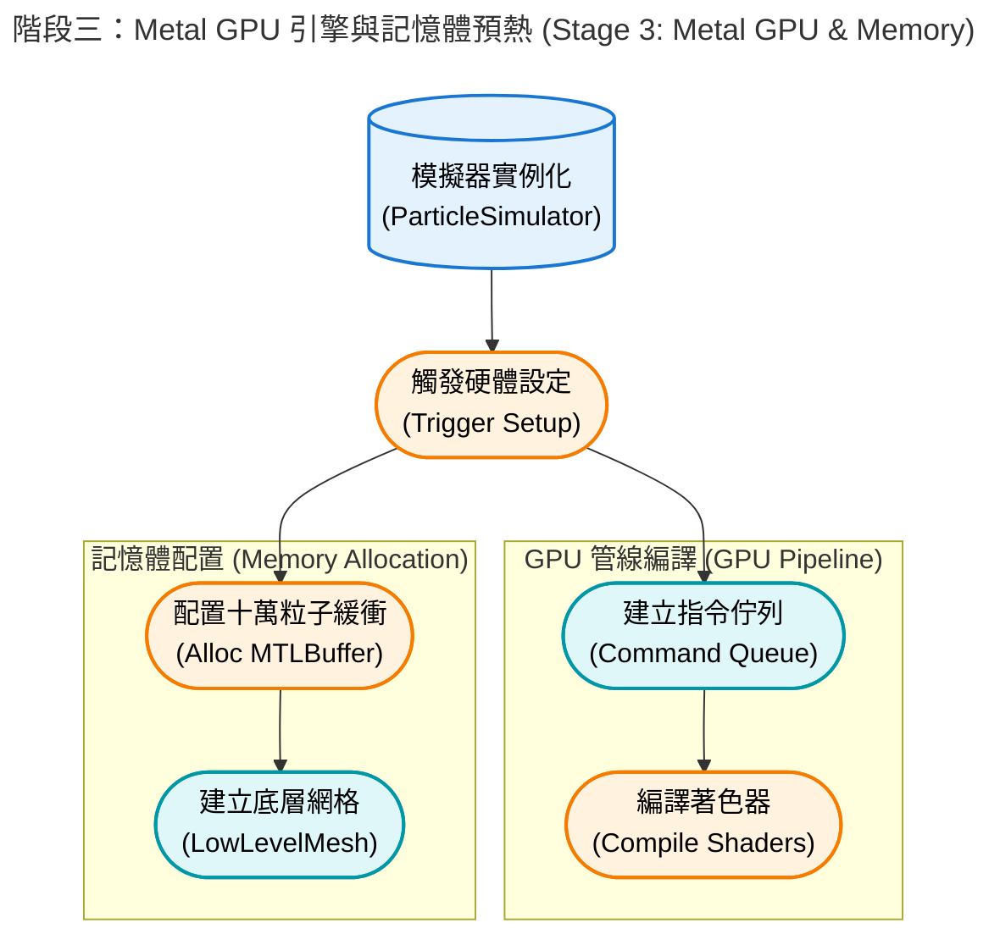
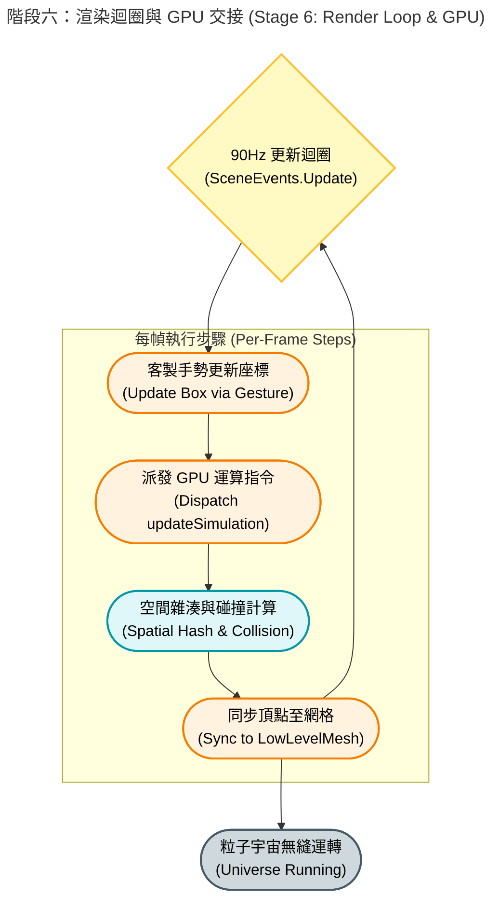
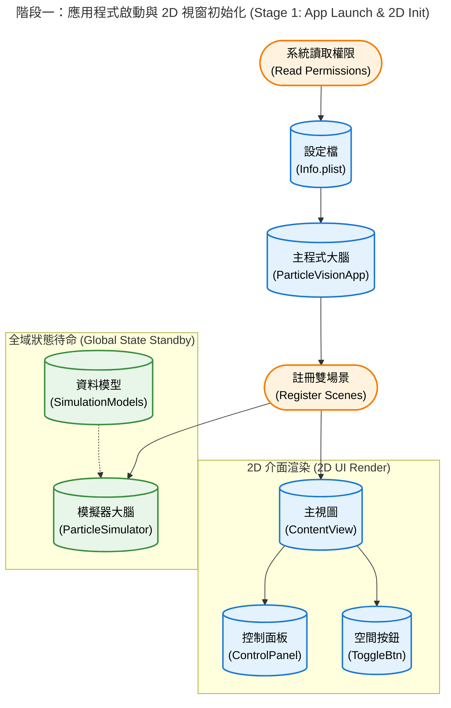
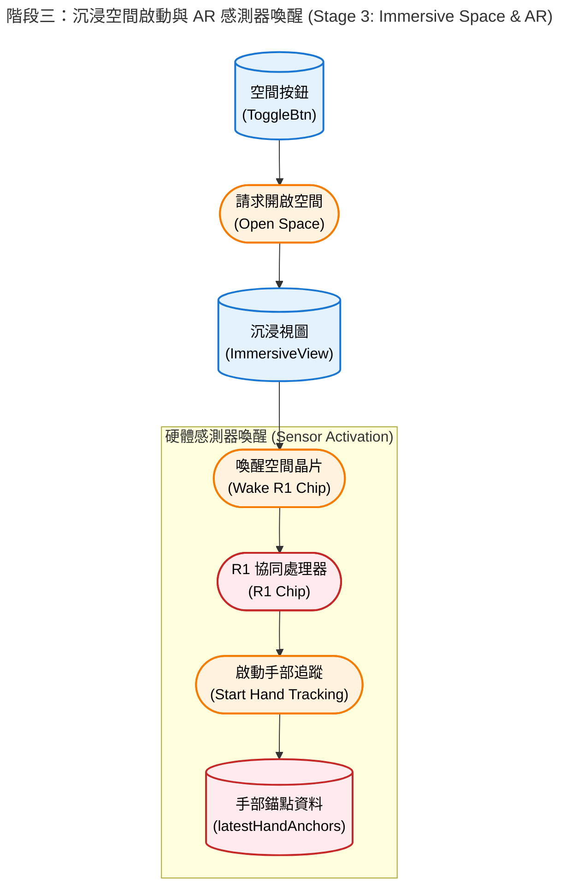
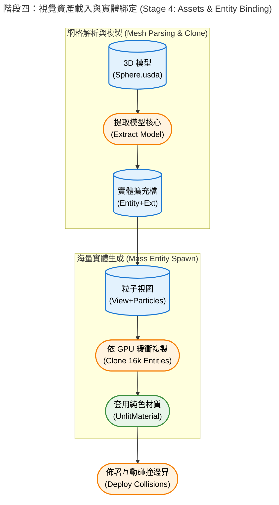

# 🌌 Particle Life visionOS


- 為 Apple Vision Pro 打造的「粒子生命 (Particle Life)」模擬器。
- 透過結合 **`Metal Compute Shader`** 的 GPU 平行運算、**`ARKit`** 骨架手勢追蹤，以及 **`RealityKit`** 的沉浸式渲染，玩家可以直接用雙手在空間中「撈取」並擾動這個由數千顆微小粒子組成的浮游生態系。


---

## 📂 專案結構 (Project Structure)

本專案採用清晰的架構，將 UI 介面、渲染層與底層 GPU 物理引擎完全解耦：

```text
.
├── particle-vision/                  # 主要的 App 模組資料夾 (UI 與 3D 視圖)
│   ├── AppModel.swift                # 全域的 App 狀態模型 (通常用來跨 View 共享基礎狀態)
│   ├── Assets.xcassets/              # 靜態資源庫 (包含 AppIcon 3D 圖示層與全域色彩設定)
│   │   ├── AccentColor.colorset/...
│   │   └── AppIcon.solidimagestack/...
│   ├── ContainerDragGesture.swift    # 處理透明盒子拖曳移動的客製化手勢 (分離出的乾淨 ViewModifier)
│   ├── ContainerMagnifyGesture.swift # 處理透明盒子雙手縮放的客製化手勢 (分離出的乾淨 ViewModifier)
│   ├── ContentView.swift             # App 開啟時的主要 2D 視窗 (包含標題、控制面板與啟動按鈕)
│   ├── ControlPanelView.swift        # 控制台 UI 面板 (調整粒子數量、螢光強度、摩擦力、顯示 FPS 等)
│   ├── Entity+Extensions.swift       # RealityKit 實體擴充功能 (例如生成 12 根隱形碰撞邊框的語法糖)
│   ├── ImmersiveView.swift           # 主核心 3D 視圖 (負責建構 RealityView 與掛載空間音效、碰撞體)
│   ├── ImmersiveView+HandTracking.swift # 擴充檔案：專門處理 ARKit 雙手追蹤與空間座標轉換邏輯
│   ├── ImmersiveView+Particles.swift    # 擴充檔案：專門負責將底層模擬器資料同步到 RealityKit 視覺效果
│   ├── Info.plist                    # App 的系統設定檔 (權限宣告、版本號等)
│   ├── ParticleVisionApp.swift       # App 進入點 (@main 宣告，負責註冊 WindowGroup 與 ImmersiveSpace)
│   ├── Resources/                    # RealityKit 專屬的 3D 資源資料夾
│   │   ├── Immersive.usda            # 預設的沉浸式場景設定檔
│   │   ├── Materials/
│   │   │   └── GridMaterial.usda     # 網格或特定外觀的材質設定檔
│   │   └── Scene.usda                # 預設的 3D 場景檔
│   ├── SimulationSettings.swift      # 模擬器的常數設定或偏好設定模型
│   ├── Sphere.usda                   # 粒子的核心 USDA 模型模板 (我們後來改用 GPU 生成網格，此檔可能作為備用或參考)
│   └── ToggleImmersiveSpaceButton.swift # 負責切換 ImmersiveSpace 啟動/關閉的 UI 按鈕組件
│
├── particle-vision.xcodeproj/        # Xcode 專案核心設定檔 (包含編譯設定、套件依賴與 target 資訊)
│   ├── project.pbxproj
│   └── project.xcworkspace/...
│
├── particle-visionTests/             # 單元測試資料夾
│   └── ParticleVisionTests.swift     # 用於撰寫基礎邏輯測試的檔案
│
├── README.md                         # 專案說明文件
│
└── Simulation/                       # 高效能粒子引擎模組 (底層物理與 Metal GPU 運算核心)
    ├── GridSorting.metal             # Metal Shader：負責空間網格 (Spatial Hashing) 的前置排序與計數 (包含 Prefix Sum)
    ├── particle-vision-Bridging-Header.h # 橋接標頭檔：讓 Swift 能讀取並使用 C/C++ 結構 (用於引入 ParticleTypes.h)
    ├── ParticlePhysics.metal         # Metal Shader：負責計算粒子引力/斥力規則、速度更新、邊界碰撞與四面體頂點輸出
    ├── ParticleSimulator.swift       # 模擬器主類別 (@Observable)：管理 CPU 端的狀態 (如 FPS計數、碰撞脈衝、UI 綁定狀態)
    ├── ParticleSimulator+Metal.swift # 模擬器 Metal 擴充：專職負責建立 MTLBuffer、設定 Pipeline 與發送 GPU Command Encoder 指令
    ├── ParticleTypes.h               # Metal 與 Swift 共享的資料結構定義 (如 Particle, SimParams, Cell 等，確保記憶體佈局一致)
    ├── SharedTypes.h                 # 其他共享的常數或基礎型別定義
    └── SimulationModels.swift        # 純 Swift 端的物理運算輔助模型或資料結構
```


## ✨ 核心特色 (Key Features)

### 🚀 突破極限的 GPU 物理運算 (Metal Compute Shader)
- **十萬級粒子渲染 (`LowLevelMesh`)**：捨棄傳統的獨立實體 (Entity)，改用純 GPU 驅動的自訂網格。透過「四面體幾何降級 (4 頂點/12 索引)」，成功在 visionOS 上流暢渲染 **100,000 顆** PBR 發光粒子。
- **空間雜湊 (Spatial Hashing)**：將 $O(N^2)$ 的碰撞複雜度降至 $O(N)$，並將空間網格最佳化至 $32^3$ (32,768 格)，完美平衡 Prefix Sum 負載與記憶體快取命中率。
- **GPU 空間排序 (Spatial Sorting)**：實作計數排序與前綴和，確保物理空間相近的粒子在 GPU 記憶體中絕對連續，榨出極致的硬體效能。

### 🖐️ 沉浸式實體反饋 (Scoop Net Physics)
- **撈魚網物理學**：當使用者移動透明盒子時，Metal 端會即時計算相對慣性 (Inertia) 與穿透動能 (Penetration Impulse)，讓邊界具備將粒子「推擠撈起」的真實物理手感。
- **精確骨架追蹤**：基於 ARKit 的手部骨架節點分析，實現穩定且無死角的單手 6-DOF 空間拖曳與雙手縮放。

### 🎛️ 即時動態控制面板 (SwiftUI)
提供無邊緣裁切、完美適配玻璃背景的空間浮動視窗，支援即時監測與調整：
- **即時 FPS 監控**：內建每秒幀率顯示器，精準掌握硬體負載與視覺流暢度。
- **粒子數量與種類**：動態增減 (1,000 ~ 100,000 顆)，支援高達 8 種屬性的粒子互相吸引/排斥。
- **螢光強度 (Glow Intensity)**：即時調整 PBR 材質的發光強度，呈現絢麗的自發光星系視覺效果。
- **空間摩擦力 (Friction)**：即時調整宇宙的「黏滯感」(0.01 泥漿阻力 ~ 0.99 太空滑行)。

---

## 🛠️ 技術細節 (Technical Details)

本專案解決了 visionOS 開發中多個高難度的效能與渲染痛點：
1. **Zero CPU Overhead 渲染機制**：利用 Metal Compute Shader 每個 Frame 直接更新 `LowLevelMesh` 的頂點與法線緩衝區 (Vertex Buffer)，實現十萬顆粒子 90 FPS 零掉幀的驚人表現。
2. **解決射線偵測 (Raycast) 盲區**：將單一實心碰撞體重構為 12 道精準的邊緣碰撞條 (Edge Shapes)，不僅消除 UI 遮蔽死角，更大幅提升手勢命中的穩定度。
3. **視窗排版完美適配**：捨棄雙重 `padding` 與寫死的背景，改用適當的最小長寬限制搭配安全邊距，根除系統預設圓角造成的 UI 跑版與邊緣裁切問題。

---

## 💻 系統需求 (Requirements)

* **硬體**: Apple Vision Pro (實機測試表現最佳) 或 visionOS Simulator
* **系統**: visionOS 2.0+ (需支援 `LowLevelMesh` 相關 API)
* **開發環境**: Xcode 16.0+ (請確保以 **Release Mode** 建置以獲得最佳物理模擬幀率)

---

## 🎮 如何操作 (How to Play)

1. 點擊主畫面的 **「啟動十萬粒子宇宙」** 進入沉浸式空間。
2. 觀察高達 10 萬顆的四面體粒子，依據隨機生成的引力矩陣逐漸聚集成細胞、薄膜或絢麗的星系結構。
3. **調整與觀察**：在控制面板即時監看 FPS，隨意拉動數量與發光強度，並隨時點擊「隨機引力規則」重組基因矩陣。
4. **互動與碰撞**：單手捏合 (Pinch) 邊界盒子的任一處並拖曳，像拿著網子一樣在空間中撈取粒子，體驗真實的推擠與反彈動能。

---
## ⚙️ 運作原理 (Under the Hood)

- 在 Apple Vision Pro 的主畫面（Home View）點擊這個 App 的 3D 圖示（`AppIcon.solidimagestack`）時，visionOS 系統會啟動一連串精密的軟硬體協作程序。以下是依照時間序展開的檔案載入、相依性建立與硬體資源調用流程：

### 1. App 進入點與生命週期註冊
visionOS 讀取 `Info.plist` 確認系統權限與環境配置後，進入 `@main` 標記的 `ParticleVisionApp.swift`。系統會在此向作業系統註冊兩個核心場景容器：一個是用於顯示 2D UI 的 `WindowGroup`（負責載入 `ContentView`），另一個是預備用來渲染 3D 空間的 `ImmersiveSpace`（綁定 `ImmersiveView`），並同步初始化全域的環境狀態。


### 2. 2D 視窗渲染與 UI 實例化
系統接著繪製 `ContentView.swift`，並根據程式碼中設定的 `frame(width: 750, height: 850)` 向 visionOS 請求一塊精確大小的 2D 視窗，並套用系統原生的玻璃背景效果（Glass Background）。此時 `ControlPanelView.swift` 內的各項滑桿與按鈕也一併實例化，進入等待使用者互動的就緒狀態。


### 3. Metal GPU 引擎與記憶體預熱
當負責核心運算的 `ParticleSimulator` 被實例化時，會立即觸發底層的 `setupMetal()` 與 `setupBuffers()`。此階段 CPU 會向 Apple Silicon 晶片請求建立 Command Queue，編譯 `ParticlePhysics.metal` 與 `GridSorting.metal` 成可執行的 Compute Pipeline，並在實體記憶體中配置容納 10 萬顆粒子與 32³ 空間網格所需的 `MTLBuffer`，最後建立 `LowLevelMesh` 準備承接巨量的頂點資料。



### 4. 沉浸式空間轉換 (Immersive Transition)
當使用者點擊「啟動十萬粒子宇宙」時，按鈕觸發 `openImmersiveSpace` API。visionOS 接到指令後，會平滑地將應用程式狀態切換至沉浸模式（Mixed Reality），解鎖立體空間的渲染權限，並開始執行 `ImmersiveView.swift` 的載入邏輯。


### 5. RealityKit 場景建構與 ARKit 啟動
在 `ImmersiveView` 中，RealityKit 會先生成核心的透明實體 `containerBox`，並利用 `Entity+Extensions.swift` 附加 12 道隱形的碰撞邊界組件（CollisionComponent）。同時，非同步任務（Task）會向系統請求手部骨架追蹤權限，啟動 `ARKitSession` 與 `HandTrackingProvider`，開始捕捉雙手的 6-DOF 空間座標。


### 6. 渲染迴圈 (Render Loop) 與 GPU 交接
一切就緒後，視圖會訂閱 `SceneEvents.Update.self`，將每秒最高 90 次的畫面更新權正式交棒給模擬器。在每一個 Frame 中，系統會嚴格依序執行：透過客製化手勢更新盒子座標 $\rightarrow$ 派發 GPU 運算指令 (`updateSimulation`) 進行空間雜湊與碰撞計算 $\rightarrow$ 將算好的頂點與法線資料同步回 RealityKit 的 `LowLevelMesh`。至此，整個粒子宇宙開始無縫運轉。



---
### 1. 應用程式啟動與 2D 視窗初始化 (CPU 主導)

* **讀取設定與進入點：** 系統首先讀取 `Info.plist` 確認權限（如手部追蹤要求），接著進入 `@main` 標記的 **`ParticleVisionApp.swift`**。這裡是 App 的大腦，它會向系統註冊兩種場景：一個預設開啟的 `WindowGroup` (2D 視窗) 以及一個待命的 `ImmersiveSpace` (3D 空間)。
* **建構控制介面：** CPU 接著載入 **`ContentView.swift`** 並將其渲染在 2D 玻璃視窗上。在此同時，**`ControlPanelView.swift`** 與 **`ToggleImmersiveSpaceButton.swift`** 也被實例化，準備接收使用者的輸入。此時 GPU 負載極低，僅處理標準的 SwiftUI 渲染。
* **全域狀態待命：** 若你在 App 層級注入了 `@State var simulator = ParticleSimulator()`，此時 **`ParticleSimulator.swift`** 會進行初步實例化，並讀取 **`SimulationModels.swift`** 定義的基礎資料結構。



### 2. GPU 資源配置與 Metal 管道編譯 (GPU 主導)

當 `ParticleSimulator` 被實例化時，會立即觸發其 `init()` 流程，這是打通底層硬體的關鍵時刻：

* **呼叫 Metal 框架：** 流程進入 **`ParticleSimulator+Metal.swift`**，系統會透過 `MTLCreateSystemDefaultDevice()` 喚醒 Apple Silicon (M2 晶片) 的 GPU。
* **載入並編譯著色器：** GPU 會讀取由 **`GridSorting.metal`** 與 **`ParticlePhysics.metal`** 預先編譯好的 `.metallib` 檔案。系統會透過 **`ParticleTypes.h`** 與 **`SharedTypes.h`** 確保 Swift 與 C++ 之間的記憶體對齊，隨後建立出如 `clearGridPipeline`、`computeGridPipeline` 等計算管線狀態（Compute Pipeline States）。
* **分配共享記憶體：** 系統會在統一記憶體架構（UMA）中劃分出 `particleBuffer` 與 `gridBuffer`。這些記憶體被標記為 `.storageModeShared` 或 `.storageModePrivate`，讓 CPU 與 GPU 能以零拷貝（Zero-copy）的高效方式存取 16,000 顆粒子的初始位置與速度。


### 3. 沉浸空間啟動與 AR 感測器喚醒 (R1 晶片與感測器)

當你在 2D 視窗點擊「啟動 3D 粒子空間」時：

* **觸發空間轉換：** **`ToggleImmersiveSpaceButton.swift`** 向系統發送 `openImmersiveSpace(id: "ParticleSpace")` 的非同步請求。
* **建構 3D 視圖：** visionOS 淡出背景，載入 **`ImmersiveView.swift`**。
* **喚醒空間運算硬體：** `ImmersiveView` 內部的 `.task` 啟動 `ARKitSession` 與 `HandTrackingProvider`。這會直接喚醒 Vision Pro 的 **R1 晶片**（負責即時感測器處理），啟動向下的追蹤攝影機與紅外線感測器，開始以極低延遲捕捉使用者的雙手骨骼節點，並將資料寫入 `latestHandAnchors`。



### 4. 視覺資產載入與實體綁定 (CPU 與 RealityKit 引擎)

* **載入 3D 網格：** CPU 讀取專案目錄下的 **`Sphere.usda`**，交由 **`Entity+Extensions.swift`** 進行解析並提取出模型核心（`findModelEntity`）。
* **生成海量實體：** 流程進入 **`ImmersiveView+Particles.swift`** 的 `setupParticleVisuals`。CPU 會根據 GPU 剛算好的 `particleBuffer`，在記憶體中快速 Clone 出 16,000 個 RealityKit `Entity`（或者在最新架構中使用 `LowLevelMesh`），並為不同分群套用純色材質（UnlitMaterial）。
* **部署互動邊界：** `Entity+Extensions.swift` 會為 `containerBox` 繪製白色的霓虹邊框，並加上 `CollisionComponent` 與 `InputTargetComponent`，使其能接收空間手勢。



### 5. 90Hz 渲染與物理模擬迴圈 (CPU、GPU、R1 協同運作)

當一切準備就緒，系統會以每秒 90 幀的速度觸發 `SceneEvents.Update` 迴圈：

* **手部輸入與慣性處理 (R1 -> CPU)：** **`ContainerDragGesture.swift`** 與 **`ContainerMagnifyGesture.swift`** 監聽捏合與縮放。**`ImmersiveView+HandTracking.swift`** 讀取 R1 晶片傳來的最新手部矩陣，若發生位移，則呼叫 `simulator.applyInertia()`，由 CPU 即時修改 GPU 緩衝區內的粒子速度向量。
* **Metal 平行運算 (CPU -> GPU)：** **`ParticleSimulator+Metal.swift`** 的 `updateSimulation()` 派發 Command Buffer。GPU 的數千個核心瞬間啟動，依序執行網格清除、粒子分類（`GridSorting.metal`）、以及基於細胞自動機規則的引力/排斥力與邊界碰撞計算（`ParticlePhysics.metal`）。
* **畫面渲染 (GPU -> 顯示器)：** 最後，**`ImmersiveView+Particles.swift`**（或直接透過 `LowLevelMesh` 的 Vertex Shader）將 GPU 算出的最新位置同步給 RealityKit。畫面被送入雙眼的高解析度 Micro-OLED 顯示器，完成一次完美的視覺更新。


---

## 📄 授權協議 (License)

本專案採用 [MIT License](LICENSE) 授權。歡迎自由 Fork、修改與應用於你的 visionOS 專案中！
---
