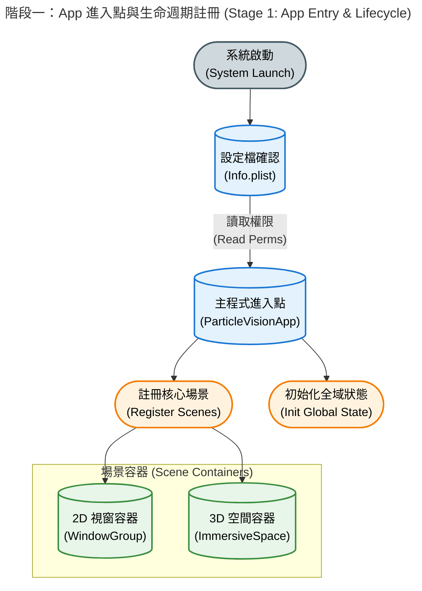
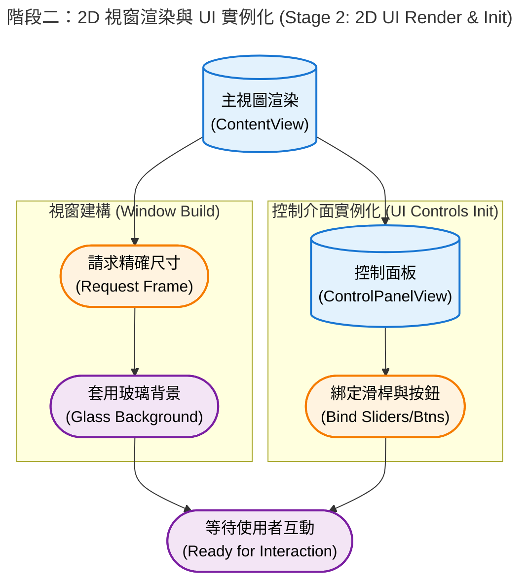
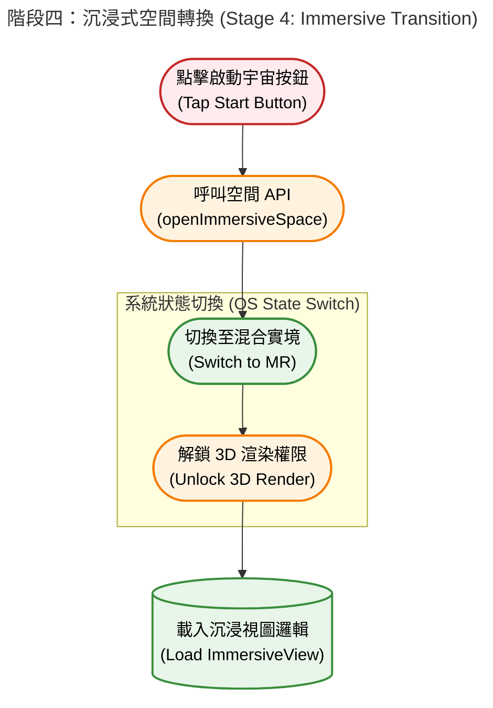
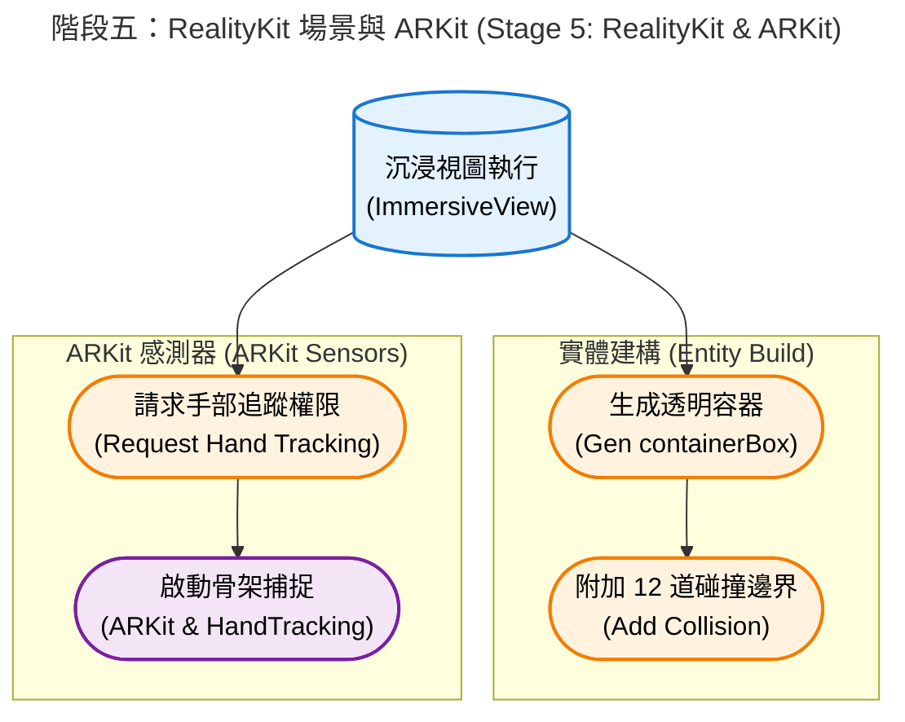

# 🌌 Particle Life visionOS


- 為 Apple Vision Pro 打造的「粒子生命 (Particle Life)」模擬器。
- 透過結合 **`Metal Compute Shader`** 的 GPU 平行運算、**`ARKit`** 骨架手勢追蹤，以及 **`RealityKit`** 的沉浸式渲染，玩家可以直接用雙手在空間中「撈取」並擾動這個由數千顆微小粒子組成的浮游生態系。


---

<div align="center">

### Quick Start

**[Technical Summary](#️-技術摘要-technical-summary) · [Project Structure](#-專案結構-project-structure) · [Under the Hood](#️-運作原理-under-the-hood) · [Grid Sorting ](#grid-sorting-and-前綴和-prefix-sum--排序-counting-sort) · [Memory Alignment](#memory-alignment) · [Local Indices](#local-indices) · [40-Byte Stride](#40-byte-stride)**

</div>

---

---
## ✨ 核心特色 (Key Features)

### 🚀 突破極限的 GPU 物理運算 (Metal Compute Shader)
- **十萬級粒子渲染 (`LowLevelMesh`)**：捨棄傳統的獨立實體 (Entity)，改用純 GPU 驅動的自訂網格。透過「四面體幾何降級 (4 頂點/12 索引)」，在 visionOS 上流暢渲染 **100,000 顆** PBR 發光粒子。
- **空間雜湊 (Spatial Hashing)**：將 $O(N^2)$ 的碰撞複雜度降至 $O(N)$，並將空間網格最佳化至 $32^3$ (32,768 格)美平衡 Prefix Sum 負載與記憶體快取命中率。
- **GPU 空間排序 (Spatial Sorting)**：實作計數排序與前綴和，確保物理空間相近的粒子在 GPU 記憶體中絕對連續，榨出硬體效能。

### 🖐️ 沉浸式實體反饋 (Scoop Net Physics)
- **撈魚網物理學**：當使用者移動透明盒子時，Metal 端會即時計算相對慣性 (Inertia) 與穿透動能 (Penetration Impulse)，讓邊界具備將粒子「推擠撈起」的真實物理手感。
- **骨架追蹤**：基於 ARKit 的手部骨架節點分析，實現單手 6-DOF 空間拖曳與雙手縮放。

### 🎛️ 即時動態控制面板 (SwiftUI)
無邊緣裁切、適配玻璃背景的空間浮動視窗，支援即時監測與調整：
- **即時 FPS 監控**：每秒幀率顯示器，掌握硬體負載與視覺流暢度。
- **粒子數量與種類**：動態增減 (1,000 ~ 100,000 顆)，支援高達 8 種屬性的粒子互相吸引/排斥。
- **螢光強度 (Glow Intensity)**：即時調整 PBR 材質的發光強度，呈現絢麗的自發光星系視覺效果。
- **空間摩擦力 (Friction)**：即時調整宇宙的「黏滯感」(0.01 泥漿阻力 ~ 0.99 太空滑行)。

---

## 🛠️ [技術摘要 (Technical Summary)](#quick-start)

解決 visionOS 多個高難度的效能與渲染痛點：
1. **Zero CPU Overhead 渲染機制**：利用 Metal Compute Shader 每個 Frame 直接更新 `LowLevelMesh` 的`頂點` (`Vertex`) 與`法線`(`Normal Vector`)緩衝區 (`Vertex Buffer`)，實現十萬顆粒子 90 FPS 表現。
2. **解決射線偵測 (Raycast) 盲區**：將單一實心碰撞體重構為 12 道精準的邊緣碰撞條 (Edge Shapes)，消除 UI 遮蔽死角，提升手勢命中的穩定度。
3. **視窗排版**：用適當的最小長寬限制搭配安全邊距，根除系統預設圓角造成的 UI 跑版與邊緣裁切問題。

---

## 💻 系統需求 (Requirements)

* **硬體**: Apple Vision Pro (實機測試表現最佳) 或 visionOS Simulator
* **系統**: visionOS 2.0+ (需支援 `LowLevelMesh` 相關 API)
* **開發環境**: Xcode 16.0+ (請確保以 **Release Mode** 建置以獲得最佳物理模擬幀率)

---

## 🎮 如何操作 (How to Play)

1. 點擊主畫面的 **「啟動十萬粒子宇宙」** 進入沉浸式空間。
2. 觀察高達 10 萬顆的四面體粒子，依據隨機生成的引力矩陣逐漸聚集成細胞、薄膜或絢麗的星系結構。
3. **調整與觀察**：在控制面板即時監看 FPS，隨意拉動數量與發光強度，並隨時點擊「隨機引力規則」重組基因矩陣。
4. **互動與碰撞**：單手捏合 (Pinch) 邊界盒子的任一處並拖曳，像拿著網子一樣在空間中撈取粒子，體驗真實的推擠與反彈動能。

---
## 📂 [專案結構 (Project Structure)](#quick-start)

- UI 介面、渲染層與底層 GPU 物理引擎完全解耦：

```text
.
├── particle-vision/                  # 主要的 App 模組資料夾 (UI 與 3D 視圖)
│   ├── AppModel.swift                # 全域的 App 狀態模型 (通常用來跨 View 共享基礎狀態)
│   ├── Assets.xcassets/              # 靜態資源庫 (包含 AppIcon 3D 圖示層與全域色彩設定)
│   │   ├── AccentColor.colorset/...
│   │   └── AppIcon.solidimagestack/...
│   ├── ContainerDragGesture.swift    # 處理透明盒子拖曳移動的客製化手勢 (分離出的乾淨 ViewModifier)
│   ├── ContainerMagnifyGesture.swift # 處理透明盒子雙手縮放的客製化手勢 (分離出的乾淨 ViewModifier)
│   ├── ContentView.swift             # App 開啟時的主要 2D 視窗 (包含標題、控制面板與啟動按鈕)
│   ├── ControlPanelView.swift        # 控制台 UI 面板 (調整粒子數量、螢光強度、摩擦力、顯示 FPS 等)
│   ├── Entity+Extensions.swift       # RealityKit 實體擴充功能 (例如生成 12 根隱形碰撞邊框的語法糖)
│   ├── ImmersiveView.swift           # 主核心 3D 視圖 (負責建構 RealityView 與掛載空間音效、碰撞體)
│   ├── ImmersiveView+HandTracking.swift # 擴充檔案：專門處理 ARKit 雙手追蹤與空間座標轉換邏輯
│   ├── ImmersiveView+Particles.swift    # 擴充檔案：專門負責將底層模擬器資料同步到 RealityKit 視覺效果
│   ├── Info.plist                    # App 的系統設定檔 (權限宣告、版本號等)
│   ├── ParticleVisionApp.swift       # App 進入點 (@main 宣告，負責註冊 WindowGroup 與 ImmersiveSpace)
│   ├── Resources/                    # RealityKit 專屬的 3D 資源資料夾
│   │   ├── Immersive.usda            # 預設的沉浸式場景設定檔
│   │   ├── Materials/
│   │   │   └── GridMaterial.usda     # 網格或特定外觀的材質設定檔
│   │   └── Scene.usda                # 預設的 3D 場景檔
│   ├── SimulationSettings.swift      # 模擬器的常數設定或偏好設定模型
│   ├── Sphere.usda                   # 粒子的核心 USDA 模型模板 (我們後來改用 GPU 生成網格，此檔可能作為備用或參考)
│   └── ToggleImmersiveSpaceButton.swift # 負責切換 ImmersiveSpace 啟動/關閉的 UI 按鈕組件
│
├── particle-vision.xcodeproj/        # Xcode 專案核心設定檔 (包含編譯設定、套件依賴與 target 資訊)
│   ├── project.pbxproj
│   └── project.xcworkspace/...
│
├── particle-visionTests/             # 單元測試資料夾
│   └── ParticleVisionTests.swift     # 用於撰寫基礎邏輯測試的檔案
│
├── README.md                         # 專案說明文件
│
└── Simulation/                       # 高效能粒子引擎模組 (底層物理與 Metal GPU 運算核心)
    ├── GridSorting.metal             # Metal Shader：負責空間網格 (Spatial Hashing) 的前置排序與計數 (包含 Prefix Sum)
    ├── particle-vision-Bridging-Header.h # 橋接標頭檔：讓 Swift 能讀取並使用 C/C++ 結構 (用於引入 ParticleTypes.h)
    ├── ParticlePhysics.metal         # Metal Shader：負責計算粒子引力/斥力規則、速度更新、邊界碰撞與四面體頂點輸出
    ├── ParticleSimulator.swift       # 模擬器主類別 (@Observable)：管理 CPU 端的狀態 (如 FPS計數、碰撞脈衝、UI 綁定狀態)
    ├── ParticleSimulator+Metal.swift # 模擬器 Metal 擴充：專職負責建立 MTLBuffer、設定 Pipeline 與發送 GPU Command Encoder 指令
    ├── ParticleTypes.h               # Metal 與 Swift 共享的資料結構定義 (如 Particle, SimParams, Cell 等，確保記憶體佈局一致)
    ├── SharedTypes.h                 # 其他共享的常數或基礎型別定義
    └── SimulationModels.swift        # 純 Swift 端的物理運算輔助模型或資料結構
```

---
## ⚙️ [運作原理 (Under the Hood)](#quick-start)

- 在 Apple Vision Pro 的主畫面（Home View）點擊這個 App 的 3D 圖示（`AppIcon.solidimagestack`）時，visionOS 系統會啟動一連串精密的軟硬體協作程序。以下是依照時間序展開的檔案載入、相依性建立與硬體資源調用流程：

### 1. App 進入點與生命週期註冊
- visionOS 讀取 `Info.plist` 確認系統權限與環境配置後，進入 `@main` 標記的 `ParticleVisionApp.swift`。
- 系統會在此向作業系統註冊兩個核心場景容器：
    - 一個是用於顯示 2D UI 的 `WindowGroup`（負責載入 `ContentView`）
    - 另一個是預備用來渲染 3D 空間的 `ImmersiveSpace`（綁定 `ImmersiveView`），並同步初始化全域的環境狀態。



### 2. 2D 視窗渲染與 UI 實例化
- 系統接著繪製 `ContentView.swift`，並根據程式碼中設定的 `frame(width: 750, height: 850)` 向 visionOS 請求一塊精確大小的 2D 視窗，並套用系統原生的玻璃背景效果（Glass Background）。
- 此時 `ControlPanelView.swift` 內的各項滑桿與按鈕也一併實例化，進入等待使用者互動的就緒狀態。



### 3. Metal GPU 引擎與記憶體預熱
- 當負責核心運算的 `ParticleSimulator` 被實例化時，會立即觸發底層的 `setupMetal()` 與 `setupBuffers()`。
- 此階段 CPU 會向 Apple Silicon 晶片請求建立 Command Queue，編譯 `ParticlePhysics.metal` 與 `GridSorting.metal` 成可執行的 Compute Pipeline，並在實體記憶體中配置容納 10 萬顆粒子與 $32^3$ 空間網格所需的 `MTLBuffer`，最後建立 `LowLevelMesh` 準備承接巨量的頂點資料。


### 4. 沉浸式空間轉換 (Immersive Transition)
- 當使用者點擊「啟動十萬粒子宇宙」時，按鈕觸發 `openImmersiveSpace` API。
- visionOS 接到指令後，會平滑地將應用程式狀態切換至沉浸模式（Mixed Reality），解鎖立體空間的渲染權限，並開始執行 `ImmersiveView.swift` 的載入邏輯。



### 5. RealityKit 場景建構與 ARKit 啟動
- 在 `ImmersiveView` 中，RealityKit 會先生成核心的透明實體 `containerBox`，並利用 `Entity+Extensions.swift` 附加 12 道隱形的碰撞邊界組件（CollisionComponent）。
- 同時，非同步任務（Task）會向系統請求手部骨架追蹤權限，啟動 `ARKitSession` 與 `HandTrackingProvider`，開始捕捉雙手的 6-DOF 空間座標。



### 6. 渲染迴圈 (Render Loop) 與 GPU 交接
- 一切就緒後，視圖會訂閱 `SceneEvents.Update.self`，將每秒最高 90 次的畫面更新權正式交棒給模擬器。
- 在每一個 Frame 中，系統會嚴格依序執行：
    - 透過客製化手勢更新盒子座標 $\rightarrow$
    - 派發 GPU 運算指令 (`updateSimulation`) 進行空間雜湊與碰撞計算 $\rightarrow$
    - 將算好的頂點與法線資料同步回 RealityKit 的 `LowLevelMesh`。

- 至此，整個粒子宇宙開始無縫運轉。


---
## [Grid Sorting and （前綴和 Prefix Sum / 排序 Counting Sort）](#quick-start)

- 在 **`GridSorting.metal`** 中實作前綴和排序（Prefix Sum / Counting Sort），是整個模擬器能將物理計算複雜度從 $O(N^2)$ 降低至 $O(N)$ 並保持 90 FPS 的靈魂所在。其核心機制是透過 GPU 平行計算，將空間中的粒子依據所處的網格位置重新排列成**連續的記憶體區段**。

具體的實作機制與流程可分為以下三個核心階段：

### 1. 空間雜湊與細胞計數 (Spatial Hashing & Counting)
* **劃分 $32^3$ 空間網格**：系統將 3D 空間劃分為 $32 \times 32 \times 32$（共 32,768 個格子）的幾何網格。
* **計算 Grid Index**：在第一個 Compute Kernel 中，GPU 會同步讀取 10 萬顆粒子的 3D 座標，並透過雜湊函式計算出每顆粒子落在第幾個格子（Grid Index）。
* **原子加總 (Atomic Addition)**：使用 Metal 的原子操作計數器，累加每個格子內的粒子總數（Cell Count），為計數排序建立直方圖。


### 2. GPU 前綴和計算 (Prefix Sum / Inclusive & Exclusive Scan)
前綴和演算法的核心作用，是將 **「各格子的粒子數量」轉換為「該格子粒子在重排緩衝區中的起始記憶體位移 (Offset)」**：
* **前綴和位移計算**：對 32,768 個格子的數量陣列執行掃描計算。例如：若第 0 格有 5 顆粒子、第 1 格有 3 顆粒子，經 Exclusive Prefix Sum 計算後，第 0 格的起始偏移位址為 `0`，第 1 格為 `5`，第 2 格則為 `8`（`5 + 3`）。
* **定義記憶體邊界**：前綴和運算結果會直接記錄每個 `Cell` 的 `startIndex` 與 `endIndex`，明確劃分出每個網格在全局陣列中的存放區間。


### 3. 粒子記憶體重排 (Particle Scatter & Reordering)
* **寫入連續記憶體 (`Sorted Particle Buffer`)**：根據前綴和算出的起始位移，GPU 再次平行派發指令，將 10 萬顆粒子寫入新的排序緩衝區。
* **極大化快取命中率 (Cache Hit Rate)**：完成排序後，**在物理空間中相近的粒子，在 GPU 記憶體中也會被絕對連續地排列**。


### 🌟 排序完成後的物理計算效益
當後續的物理引擎 `ParticlePhysics.metal` 執行引力與斥力計算時，每顆粒子不再需要搜尋全域 10 萬顆粒子，而是直接查詢目標格子及其周圍相鄰的 27 個格子。由於這些格子的粒子資料在記憶體中高度連續，GPU Thread Group 讀取時能達到極高的 L1/L2 快取命中率，實現零 CPU 開銷的極致效能。

---

## [Memory Alignment](#quick-start)

- 在 **Particle Life visionOS** 中，記憶體對齊（Memory Alignment）是讓 C (`Bridging Header`)`、Swift` (`RealityKit`/`LowLevelMesh`) 與 `Metal` (`Compute Shader`) 三端能**共享同一塊二進位記憶體緩衝區 (`MTLBuffer`)** 的關鍵技術。若對齊不一致，GPU 寫入的位元組會被 `Swift`/`RealityKit` 錯位解析，導致畫面破圖甚至崩潰。

以下是專案中記憶體對齊的核心細節與實作規則：


### 1. 跨語言共享結構定義 (`ParticleTypes.h`)
* **Bridging Header 橋接**：透過 `particle-vision-Bridging-Header.h` 將 C 語言標頭檔 `ParticleTypes.h` 引入 Swift 中。
* **單一真理來源 (Single Source of Truth)**：`ParticleTypes.h` 同時被 Swift (`ParticleSimulator+Metal.swift`) 與 Metal Shader (`ParticlePhysics.metal`) 引入。這確保了兩端在編譯時使用完全相同的 `struct` 欄位順序與型別宣告。


### 2. Metal vector 型別的對齊規則 (Alignment Rules)
Metal Shader 與 C/Swift 對於向量型別的預設對齊方式不同：
* **`float3` vs `packed_float3`**：
  * **`float3`**：在 Metal 中預設以 **16-byte** 對齊（與 `float4` 相同，最後 4-byte 為補齊的 padding）。
  * **`packed_float3`**：精確佔用 **12-byte**（3 個 4-byte float），無強制 16-byte padding。
* **頂點結構 (`VertexData`) 的緊湊佈局**：
  在 `LowLevelMesh` 頂點資料中，專案偏好使用 `packed_float3` 來降低頂點緩衝區大小並優化 GPU 記憶體頻寬：
  ```c
  typedef struct {
      packed_float3 position; // 12 bytes (Offset 0)
      packed_float3 normal;   // 12 bytes (Offset 12)
      float4        color;    // 16 bytes (Offset 24)
  } VertexData; // 總 Stride = 40 bytes
  ```


### 3. Swift 端的 `LowLevelMesh` Layout 映射
為了讓 `RealityKit` 讀懂 `Metal Shader` 直接寫入 `MTLBuffer` 的頂點，`Swift` 端建立 `LowLevelMesh` 時必須嚴格設定 `VertexLayout` 的`位移` (`Offset`) 與`步距` (`Stride`)：

```swift
// Swift 中的 LowLevelMesh 宣告範例
var vertexLayout = LowLevelMesh.VertexLayout()
vertexLayout.attributes = [
    .init(format: .float3, offset: 0,  attribute: .position), // 對應 packed_float3 position (12 bytes)
    .init(format: .float3, offset: 12, attribute: .normal),   // 對應 packed_float3 normal (12 bytes)
    .init(format: .float4, offset: 24, attribute: .color)     // 對應 float4 color (16 bytes)
]
vertexLayout.stride = 40 // 必須精確等於 C/Metal 端 sizeof(VertexData)
```

---

### 4. 記憶體對齊帶來的極致效能
1. **零記憶體拷貝 (Zero Copy)**：Metal Compute Shader 將四面體 4 個頂點的 3D 座標、法線與顏色算好後，直接覆寫映射好的 `MTLBuffer`。
2. **無縫 GPU-to-Render**：RealityKit 依據上述 40-byte 步距的 `VertexLayout` 直接讀取相同的 `MTLBuffer`，實現全 GPU 驅動的零 CPU 開銷渲染 (Zero CPU Overhead)。

---
## [Local Indices](#quick-start)

- 每顆粒子被幾何降級為包含 **4 個頂點** 與 **12 個三角形索引 (Indices)** 的正四面體。這 12 個索引的計算原理分為 **局部幾何面定義** 與 **全域記憶體位移算式**：


### 1. 單一四面體的局部索引構建 (Local Face Indices)

一個正四面體共有 4 個頂點（局部編號為 `0, 1, 2, 3`），這 4 個頂點可組合為 **4 個三角形面**：

* **面 1 (底面)**：由頂點 `(0, 1, 2)` 組成
* **面 2 (側面 1)**：由頂點 `(0, 2, 3)` 組成
* **面 3 (側面 2)**：由頂點 `(0, 3, 1)` 組成
* **面 4 (頂面)**：由頂點 `(1, 3, 2)` 組成

每個三角形面由 3 個頂點索引組成，因此單一四面體的 **12 個局部索引順序** 為：

${LocalIndices} = [\text{ 0, 1, 2,;  0, 2, 3,;  0, 3, 1,;  1, 3, 2 }]$

> **頂點繞序 (Winding Order)**：索引順序嚴格遵循逆時針 (CCW) 順序，確保 GPU 渲染時 4 個面的幾何法線方向皆正確朝向體外。


### 2. 全局 10 萬顆粒子的索引位移公式 (Global Index Offset)

在 `LowLevelMesh` 的索引緩衝區 (Index Buffer) 中，全域共存放了 (100,000 times 12 = 1,200,000) 個整數索引。

對於第 (i) 顆粒子（(i in )）：
1. 其 4 個頂點在頂點緩衝區 (Vertex Buffer) 中的**起始編號**為：
   ${baseVertex} = {i \times 4}$
2. 其 12 個全域索引在 Index Buffer 中的寫入公式如下：

```swift
// Swift 初始化階段寫入靜態 Index Buffer 的算式
for i in 0..<particleCount {
    let baseVertex = UInt32(i * 4)
    let baseIndex  = i * 12
    
    // 面 1 (0, 1, 2)
    indices[baseIndex + 0] = baseVertex + 0
    indices[baseIndex + 1] = baseVertex + 1
    indices[baseIndex + 2] = baseVertex + 2
    
    // 面 2 (0, 2, 3)
    indices[baseIndex + 3] = baseVertex + 0
    indices[baseIndex + 4] = baseVertex + 2
    indices[baseIndex + 5] = baseVertex + 3
    
    // 面 3 (0, 3, 1)
    indices[baseIndex + 6] = baseVertex + 0
    indices[baseIndex + 7] = baseVertex + 3
    indices[baseIndex + 8] = baseVertex + 1
    
    // 面 4 (1, 3, 2)
    indices[baseIndex + 9]  = baseVertex + 1
    indices[baseIndex + 10] = baseVertex + 3
    indices[baseIndex + 11] = baseVertex + 2
}
```

### 3. 靜態預計算與效能優勢

* **一次性預計算**：這 1,200,000 個索引在系統初始化的 `setupBuffers()` 階段一次性寫入 `MTLBuffer`。
* **零 CPU 負擔 (Zero CPU Overhead)**：由於拓樸結構固定，執行期索引緩衝區完全維持靜態。每一幀只需由 Metal Compute Shader 動態更新 Vertex Buffer 中的頂點座標，即可達成 90 FPS 零掉幀渲染。

---
## [40-Byte Stride](#quick-start)

- 共享結構定義 **`ParticleTypes.h`** 中，`LowLevelMesh` 的頂點結構 **`VertexData`** 總步距（Stride）為 **40 Bytes**，其計算是由各欄位的型別大小與 Offset 累加而得：


### 1. 欄位記憶體大小拆解

`VertexData` 結構包含三個欄位：`position`、`normal` 與 `color`。各欄位的記憶體佔用計算如下：

* **`packed_float3 position` (12 Bytes / Offset 0)**：
  * 由 3 個 32-bit（4 Bytes）浮點數 `(x, y, z)` 組成。
  * 計算：$3 \times 4 \text{ Bytes} = 12 \text{ Bytes}$。
* **`packed_float3 normal` (12 Bytes / Offset 12)**：
  * 由 3 個 32-bit（4 Bytes）浮點數 `(nx, ny, nz)` 組成。
  * 計算：$3 \times 4 \text{ Bytes} = 12 \text{ Bytes}$。
  * 位移（Offset）：在 `position` 之後，位移量為 $0 + 12 = 12 \text{ Bytes}$。
* **`float4 color` (16 Bytes / Offset 24)**：
  * 由 4 個 32-bit（4 Bytes）浮點數 `(r, g, b, a)` 組成。
  * 計算：$4 \times 4 \text{ Bytes} = 16 \text{ Bytes}$。
  * 位移（Offset）：在 `normal` 之後，位移量為 $12 + 12 = 24 \text{ Bytes}$。


### 2. 總步距（Total Stride）加總算式

- 將三個欄位的位元組相加：

$$\text{Total Stride} = \underbrace{12}_{\text{position}} + \underbrace{12}_{\text{normal}} + \underbrace{16}_{\text{color}} = \mathbf{40 \text{ Bytes}} \quad$$

### 3. 關鍵設計：為何使用 `packed_float3` 而非 `float3`？

* **`float3` 的隱形 Padding**：在 Metal 中，標準的 `float3` 預設以 **16-Byte** 對齊（與 `float4` 相同，末端會強制補滿 4 Bytes 的空白 Padding）。若使用 `float3`，結構會膨脹為 (16 + 16 + 16 = 48 Bytes )。
* **`packed_float3` 的緊湊佈局**：專案改採 `packed_float3`，取消強制 16-Byte 對齊，精確佔用 **12 Bytes**，成功將單一頂點大小縮減至 **40 Bytes**。這不僅節省了 16.7% 的頂點緩衝區記憶體，更極大地提升了 GPU L1/L2 快取的命中率與傳輸頻寬。

在 Swift 端配置 `LowLevelMesh` 時，將 `vertexLayout.stride` 精確指定為 **40**，即可讓 RealityKit 渲染器與 Metal Compute Shader 直接共享同一塊 `MTLBuffer` 進行無縫讀寫。


---
## 📄 授權協議 (License)

- 本專案採用 [MIT License](LICENSE) 授權。歡迎自由 Fork、修改與應用於你的 visionOS 專案中！
---
